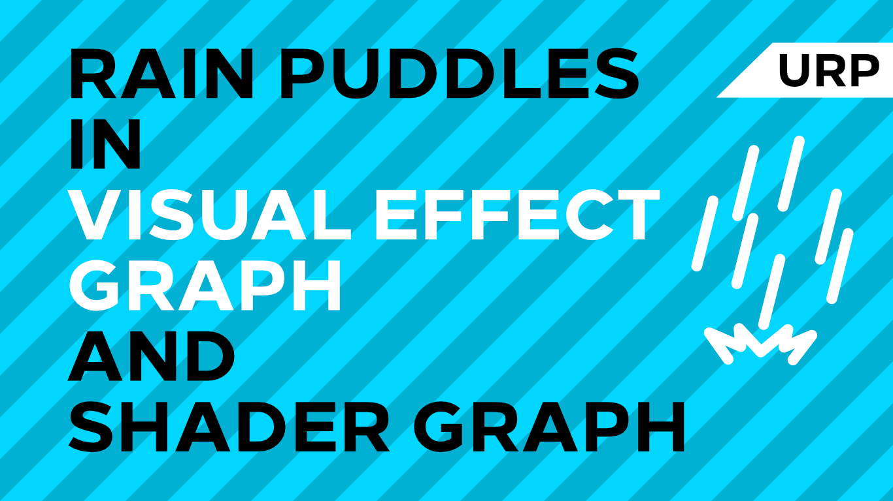

# Rain Puddles in Unity URP

A rain puddle effect using Unity Shader Graph, Visual Effect Graph and Universal Render Pipeline.

## Overview

This project contains a rain puddle shader which uses an animated raindrop texture and a 'puddle map' to determine which sections of the floor are covered in rainy puddles. On top of that, a particle effect is used to simulate falling raindrops.

https://github.com/Dunnatello/rain-urp/assets/11823777/5c242ce1-5c0e-42a3-b114-111d47844d51

## Software

This project was originally created using Unity 2019.3.0f6 and Universal Render Pipeline 7.1.8.

It has been upgraded to Unity 2023.2.11f1 and Universal Render Pipeline 16.0.5. However, there were no compile errors found during this conversion, so it should potentially work with future/previous Unity versions.

## Authors

This project and the corresponding tutorial series were written by Daniel Ilett. [Follow him on Twitter](https://twitter.com/daniel_ilett) for more game dev tutorials!

## Release

This project was initially released on May 18th 2020. 
